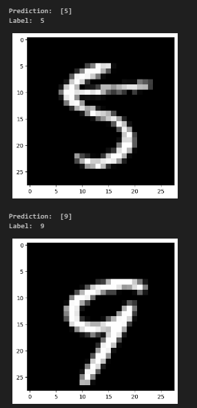

# Image Classification with Neural Networks

This repository implements a machine learning algorithm for image classification, likely using the MNIST dataset of handwritten digits.

## Functionality

The code trains a simple two-layer neural network model to classify images. Here's a breakdown of the functionalities:

### Data Loading and Preprocessing:

- Loads the training data from a CSV file (assumed to be MNIST format).
- Splits the data into training and validation sets.
- Preprocesses the data by shuffling and normalizing the feature values.

### Model Architecture:

- Implements a neural network with two fully-connected hidden layers.
- Uses ReLU activation function for hidden layers and softmax activation for the output layer.

### Training Process:

- Employs Stochastic Gradient Descent (SGD) to optimize the model parameters.
- Calculates gradients using backpropagation during training.
- Monitors the model's accuracy on the validation set during training.

## Running the Script

- Ensure you have Python libraries numpy, pandas, and matplotlib installed (`pip install numpy pandas matplotlib`).
- Replace 'train.csv' in the script with the path to your training data file if it's named differently.
- Run the script using Python (`python script_name.py`).

**Note:** This is a basic implementation for educational purposes. Hyperparameters like learning rate and number of iterations might require tuning for optimal performance on different datasets.

## Dependencies

- numpy
- pandas
- matplotlib

## Output Example:

